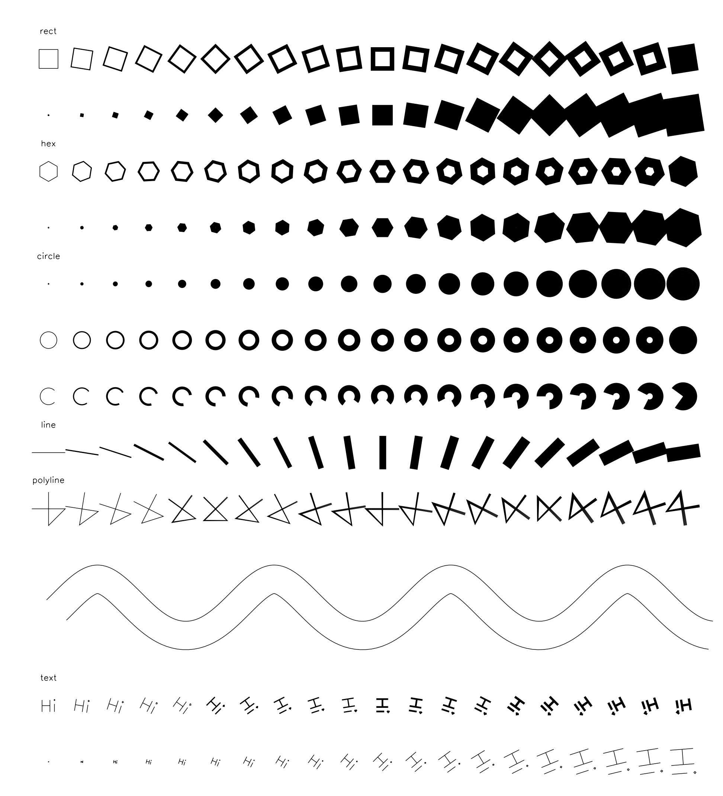
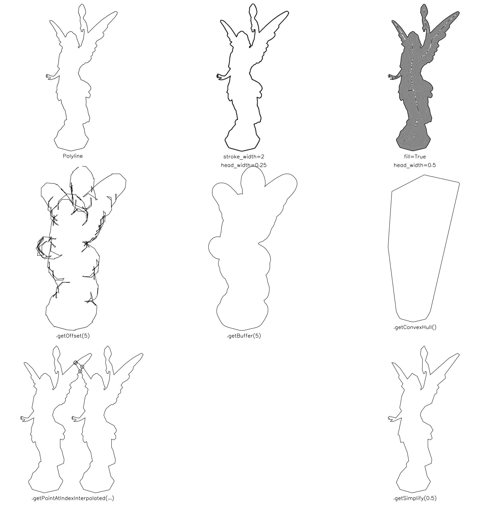
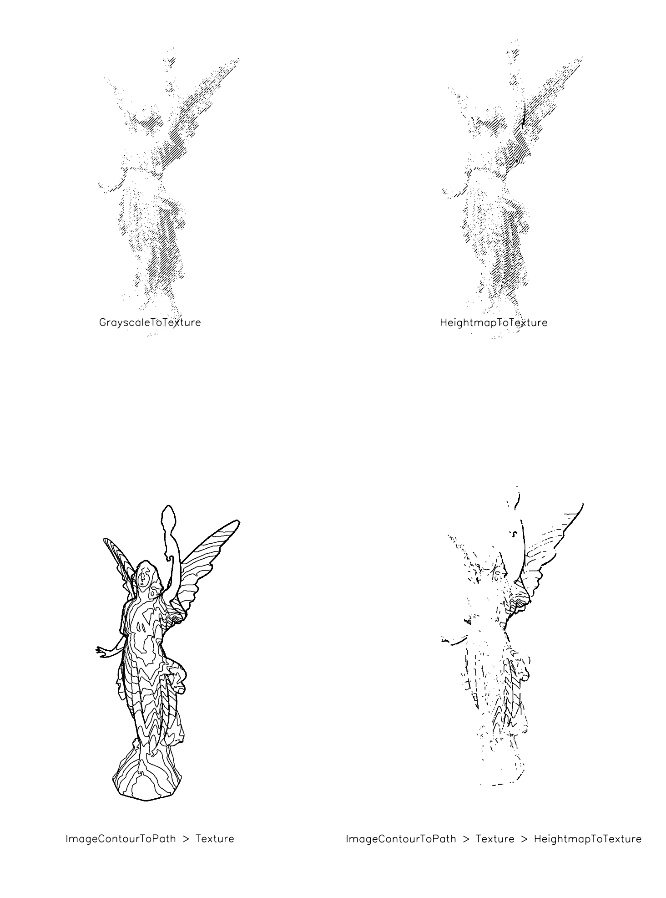

# AxiSurface

Python module to make 100% vector line compositions and export them as SVG or G-Code files. Made and tested for AxiDrawer plotter and SnapMaker CNC

Special thanks to:

 * [Michael Fogleman](https://www.michaelfogleman.com/): for [Axi](https://github.com/fogleman/axi) witch mostly of the `Path.py` class and minimization of pen-up travel time by reordering & reversing paths is based on

 * [Paul Butler](https://paulbutler.org/) for [Surface Projection tutorial](https://bitaesthetics.com/posts/surface-projection.html) witch `Texture.py` is based on

 * [Mat Handy](https://github.com/mathandy): for [SVGPathTools](https://github.com/mathandy/svgpathtools/) witch `Arc.py` and `CubicBezier` is based on

 * [Evil Mad Scientist](https://www.evilmadscientist.com/) for the great Axidrawer







## Install

Create a new conda environment and install AxiSurface:

```bash
git clone git@github.com:patriciogonzalezvivo/AxiSurface.git
cd AxiSurface
conda env create -f environment.yml
conda activate axisurface
pip install -e .
```
